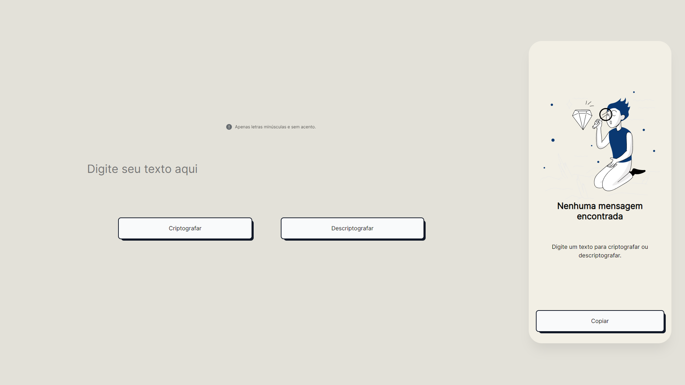

Desenvolvido para iniciantes em programação, o Desafio ONE é projetado para aplicar os conhecimentos adquiridos ao longo dos cursos da trilha de aprendizagem na Alura. A Apple contribuiu para a criação deste desafio, permitindo que os participantes se desafiem na resolução de problemas do mundo real.

Este projeto tem como objetivo criar uma aplicação para criptografar e descriptografar palavras, incluindo a funcionalidade adicional de copiar o texto criptografado ou descriptografado. A ideia é oferecer uma ferramenta prática para codificar e decodificar palavras, facilitando ainda mais o processo com a opção de copiar os resultados para uso posterior.

Este desafio proporciona uma oportunidade prática para os aprendizes testarem suas habilidades recém-adquiridas, incentivando a aplicação prática dos conceitos aprendidos. Com a parceria da Alura e o suporte da Oracle, os participantes têm a chance de aprimorar suas habilidades de programação enquanto resolvem desafios reais.

## :robot: Tecnologias
&nbsp;
&nbsp;
&nbsp;
